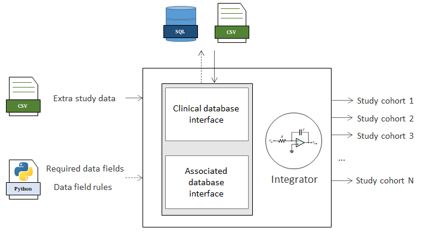

## Hi there, I'm Victor 👋

Let me give you some more information about the work I've been doing as a data scientist.

---

- *[gkoutos-group/postcode](https://github.com/gkoutos-group/postcode)* is the ETL kernel used in multiple analysis:

  

In many scenarios you have established datasets stored in different silos. Be it a hospital, census report, or your data problem. 

Integrator & postcode tools provide a mechanism to orchestrate the Extract-Transform-Load of multiple data sources into a single data frame for analysis. It is capable of handling big data in SQL or CSVs. It comes with a mapping procedure to include the indexes of different sources, reducing the number of I/O operations.

This tool built on top of Python and Pandas can reduce the time to collect an observational study from months to minutes.

---

- *[gkoutos-group/covidtracker_surgery](https://github.com/gkoutos-group/covidtracker_surgery)* is a Covid-19 tracker:

  

During the highest points of the pandemic it was noticed that patients were not going into surgery due to both risks of complications and of contracting the morbidity in the hospital quarters. The tracker of lost surgery is a tool that estimates the number of people that didn't undergo a surgery. This tool is being used for policy changes.

This tool is built in R using the Shiny framework.

---

- *[gkoutos-group/threshold_picker](https://github.com/gkoutos-group/threshold_picker)* is a support tool for model decision:

  

A risk model has trade-offs depending on the point of action. It is crucial to understand the consequences of each decision point.

This tool was developed to assess a model, and understand how it performs compared to another model.

This tool is built in R using the Shiny framework.

---

To see what impact these tools have done see [here](https://scholar.google.com/citations?user=DoD54yUAAAAJ&hl=en).
